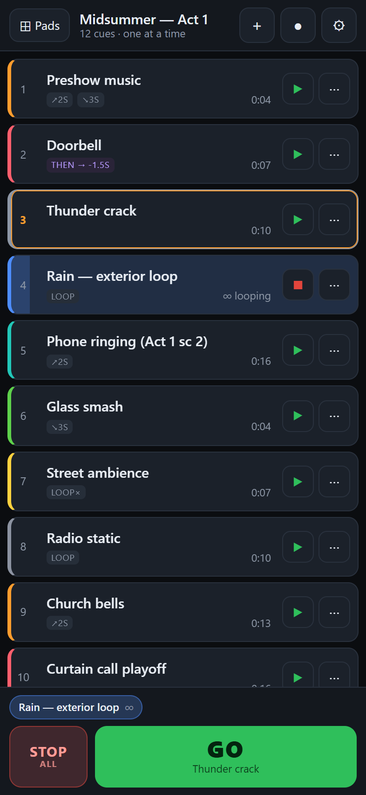
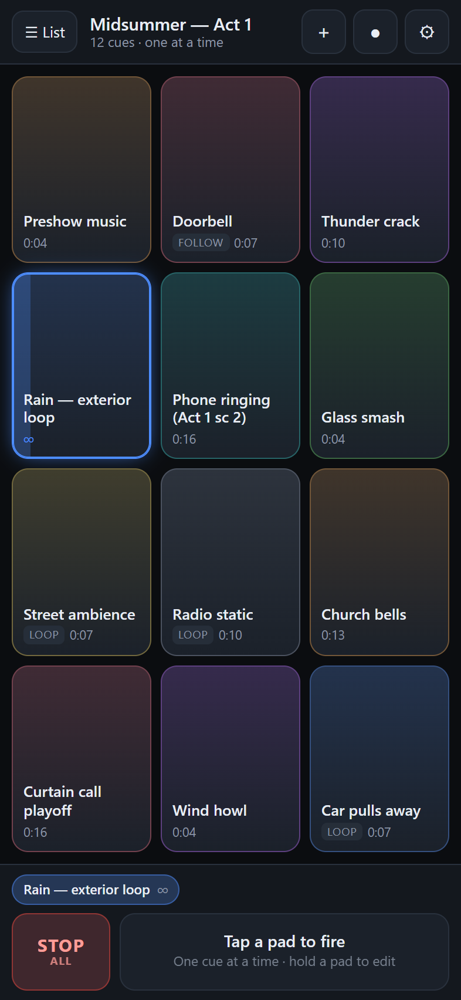
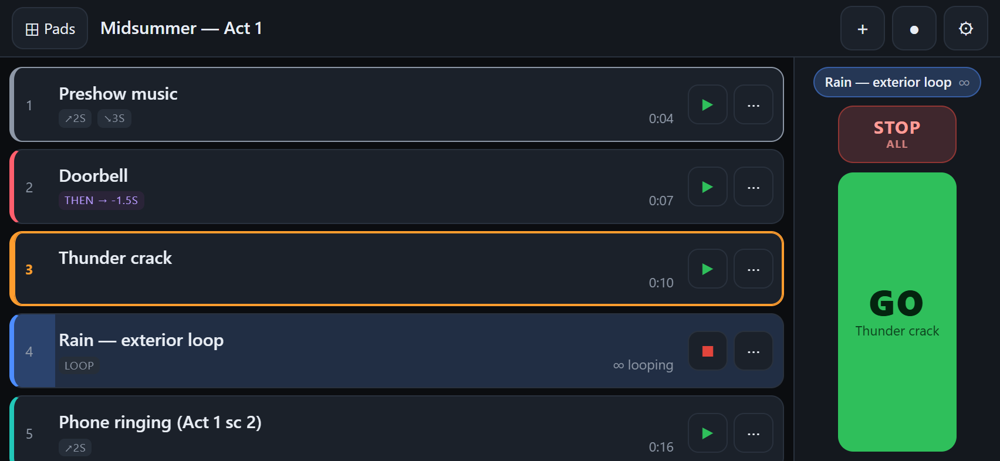
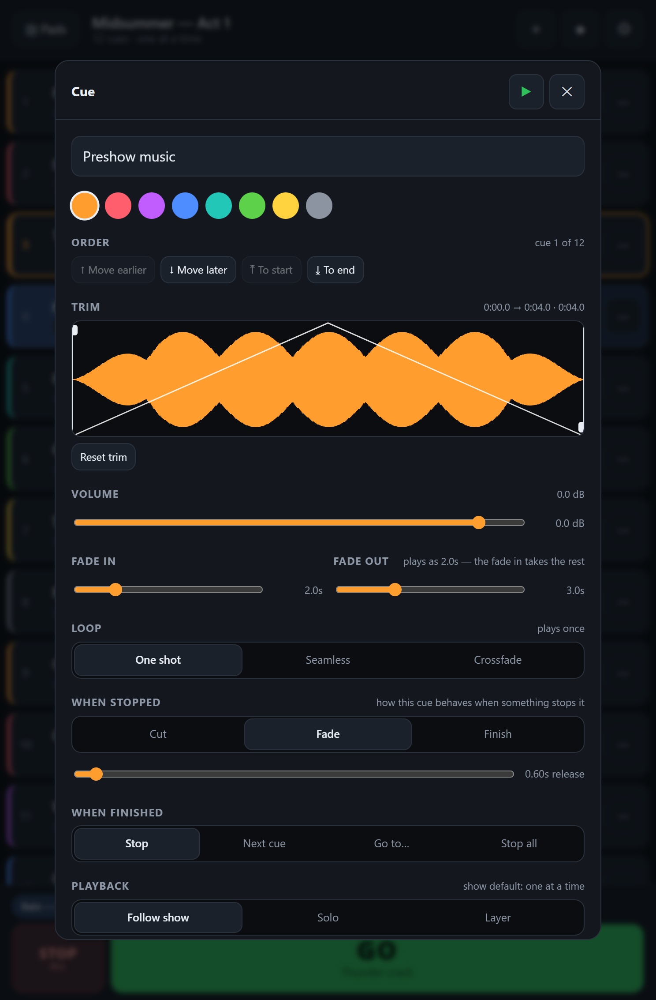

# CueTap

**Sound cue playback for small theaters and rehearsal rooms — from the phone in your pocket.**

QLab-style show control without the laptop. Two ways to drive a show over the same cue list — a
pad grid you trigger by touch, and a linear list with one big **GO** button — switchable mid-show
without interrupting audio. It installs to your home screen, runs with no network at all, and
plays out to whatever Bluetooth speaker or PA the phone is paired with.

| Cue list — press GO | Pad grid — trigger by touch |
| :---: | :---: |
|  |  |

Rotate the phone — as it would sit on a music stand — and the transport moves to a full-height
rail on the right, where GO becomes a tall thumb target:



---

## What it does

- **Two view modes** over one cue list — pad grid and list-with-GO — switchable mid-show without
  interrupting playback.
- **Per-cue control**: volume, waveform trim in/out, fade in/out, loop mode, stop behaviour and
  follow-on chaining.
- **Real loops** — sample-accurate seamless looping between trim points, or an equal-power
  crossfade loop for material with no clean loop point (room tone, rain, traffic).
- **Follow-on cues** — when a cue ends, go to the next one, jump to a named cue, or stop
  everything. A negative delay overlaps into the follow cue, which is how you build a crossfade
  between two tracks.
- **One at a time, or layered** — a global mode with a per-cue override, so an ambience bed can
  keep running under spot effects in an otherwise exclusive show.
- **Import from anywhere** — the system file picker also reaches Google Drive, Dropbox and
  OneDrive when those apps are installed. No accounts to connect.
- **Spotify cues** — a pad can play a Spotify track alongside your file cues, with its own trim,
  volume, fades and follow-on. Requires Premium; see the limits below.
- **Record** from the microphone or any external input, with a device picker for USB-C audio
  interfaces and the browser's speech processing turned off so music keeps its dynamics.
- **Foot pedal support** — space, enter, right-arrow and page-down all fire GO, so most Bluetooth
  page-turner pedals work as a GO footswitch for free.
- **Works offline**, installs to the home screen, and keeps the screen and audio session awake
  during a show.

## Quick start

```bash
npm install
npm run dev       # serves on https://localhost:5173 and a https:// LAN address
```

Open the **`https://`** LAN address the dev server prints on your phone and accept the
self-signed certificate warning once.

> **HTTPS is not optional.** On a plain `http://192.168.x.x` address the browser blocks both the
> microphone and the service worker, so recording and offline support silently stop working.

Then **Add to Home Screen** and launch it from the icon. Installed, it runs full screen, works
with no network, and is far more likely to be granted persistent storage — which is what stops
the browser evicting your audio between rehearsal and performance.

For an actual show, prefer a real build: `npm run build`, then host `dist/` anywhere static.

## Using it

**Arm first.** Pair your Bluetooth speaker, then tap to arm. Phones will not let any web page make
a sound until something is tapped, so this is a deliberate step rather than a surprise on cue 1.

**Pads.** Tap to fire. Tap a playing pad to stop it (configurable — restart or stack instead).
Hold a pad to edit it.

**List.** Tap a row to make it standby, then GO. GO fires the standby cue and advances. Escape
stops everything.

**STOP ALL** fades everything out over the release time set in Settings. Double-tap it to cut.

### Per-cue settings



- **Loop → Seamless** loops sample-accurately between the trim points with no drift. Use it when
  the material has a clean loop point.
- **Loop → Crossfade** blends the seam with an equal-power crossfade, for material that does not
  loop cleanly.
- **When stopped** decides what happens when something else stops this cue: cut, fade over the
  release time, or finish the current loop pass first.
- **When finished** chains cues, with a delay that can go negative to overlap into the next one.
- **Playback** overrides the show's one-at-a-time / layered default for this cue alone.

## Spotify cues

A cue can play a Spotify track instead of a local file. Set it up in **Settings → Spotify**:

1. Create a free app at [developer.spotify.com/dashboard](https://developer.spotify.com/dashboard).
2. Add the redirect URI that Settings shows you, **exactly** as shown. Each address you run CueTap
   on (your dev machine, your LAN address, a hosted build) is a separate URI and all of them need
   registering.
3. Paste the Client ID into Settings and connect.

> **`localhost` will not work.** Since April 2025 Spotify requires HTTPS, or an explicit loopback
> literal — [`localhost` is rejected outright](https://developer.spotify.com/documentation/web-api/concepts/redirect_uri),
> even over HTTPS, and gives you a bare `INVALID_CLIENT: Invalid redirect URI` 400 with no
> explanation. For local development open CueTap on **`http://127.0.0.1:5173`** instead. Settings
> detects this and refuses to start a login it knows Spotify will reject.

Playback requires **Spotify Premium** — the Web Playback SDK refuses to start on a free account.
The Client ID lives in your browser rather than in this repo, so every deployment brings its own.

### What a Spotify cue can and cannot do

Spotify decodes inside a protected pipeline that cannot be connected to an `AudioContext`, so none
of the Web Audio machinery reaches it. A Spotify cue is driven through the SDK's own controls, and
the difference is real:

| | Local file cue | Spotify cue |
| --- | --- | --- |
| Volume | GainNode | `setVolume()` |
| Fade in / out | Equal-power, sample-accurate | Stepped on a 50 ms timer |
| Trim in / out | Sample-accurate | `seek()`, roughly 100 ms |
| Seamless loop | Zero gap, no drift | Seeks back — short audible gap each pass |
| Crossfade loop | Yes | Not possible — there is only one player |
| Layering | Unlimited | One Spotify cue at a time |
| Trigger latency | Effectively zero, plays from RAM | 0.5–3 s of buffering |
| Offline | Works | Needs a network connection |

The editor hides the controls a Spotify cue cannot honour rather than letting you set something
that will not be heard.

**Use Spotify cues for preshow, interval and playoff music.** Use a local file for anything that
has to land on a visual cue — a doorbell or a thunder crack triggered over the network will arrive
late, and will not arrive at all if the wifi drops.

## How storage works

Everything is local to the phone, in IndexedDB, across two object stores:

| Data | Where | Notes |
| --- | --- | --- |
| Original audio files | IndexedDB `audio` store | Kept as the raw blob you imported |
| Show and cue settings | IndexedDB `kv` store | Saved 300 ms after every edit |
| Decoded audio | In memory | Cues fire from RAM, so a tap is instant |

Deleting a cue reclaims its audio only if no other cue still points at the same file. On import,
the app calls `navigator.storage.persist()` to ask the browser not to evict your audio — Settings
shows whether that was actually granted, with a button to ask again.

**There is no cloud sync or backup.** Clearing browser data, uninstalling, or an eviction without
persistence granted will take the show with it. Installing to the home screen makes persistence
far more likely to be granted.

## Layout across devices

Mobile first, with tablet as the second target; desktop works but is not the design goal.

- **Phone portrait** is the baseline — the pad grid shows exactly the column count you set.
- **Phone landscape** moves the transport into a full-height rail on the right, so vertical space
  goes to cues instead of chrome. The cue editor docks to the side rather than becoming a
  letterboxed sheet.
- **Tablet** scales type and touch targets up, and the cue editor becomes a centred dialog.
- Below 360px the show subtitle drops and the fade controls stack.

The pad column count is treated as *"pads about this big"* rather than a fixed track count: the
setting becomes a minimum pad width measured against the narrow screen dimension, and the grid
packs as many as fit. Upright you get exactly the number you chose; rotated or on a tablet the
extra width becomes more pads at the same comfortable size, instead of a few enormous ones.

## Known limits

- **Bluetooth adds 150–250 ms** of output latency on A2DP. Fine for music, beds and ambience;
  noticeable on tight spot effects. Nothing in software can fix it — use a wired output if a cue
  has to be tight.
- **Keep the app in the foreground.** Live mode holds a screen wake lock and a silent keepalive
  track, but a backgrounded or locked phone can still have its audio suspended by the OS, most
  aggressively on iOS.
- **A show lives on one phone.** No export or sync yet — the first thing worth adding.
- **Spotify cues need the network and buffer before they start.** Fine for music beds, wrong for
  spot effects. They also cannot layer, crossfade-loop, or loop without a small gap.
- **Drag-to-reorder is desktop-only**; touch browsers do not fire HTML5 drag events. On a phone,
  reorder from the Order controls in the cue editor.
- **No OSC.** Browsers have no UDP, so it would need a WebSocket-to-OSC bridge running on a
  laptop, which defeats the point of a phone-only rig.

## How it is built

No audio library — the Web Audio API directly, because `AudioBufferSourceNode` plus `GainNode` is
what gives sample-accurate trim points, drift-free loops, and fades that land exactly on the
out-point.

```
src/
  audio/
    engine.ts       AudioContext, master bus + safety limiter, voice registry, live mode
    voice.ts        one playing instance: fades, loop scheduling, follow-on
    fades.ts        equal-power fade curves
    decode.ts       blob -> AudioBuffer cache, waveform peaks
    useTransport.ts polled playback state for the UI
  data/
    types.ts        Cue / Show model
    db.ts           IndexedDB: audio blobs + show, persistence requests
    store.tsx       show state, persistence, firing, follow-on resolution
  views/            ArmScreen, PadGrid, CueList, CueEditor, Recorder, Settings
  components/       Transport (GO / STOP ALL), Waveform, shared controls
```

Signal chain per voice:

```
source -> passGain -> fadeGain -> levelGain -> master -> limiter -> output
```

`passGain` handles loop crossfades, `fadeGain` carries the cue envelope, and `levelGain` carries
the user's volume — kept separate so dragging the fader mid-cue cannot collide with a fade that is
already scheduled.

Fades are built from chained `linearRampToValueAtTime` calls rather than `setValueCurveAtTime`.
Curves are the obvious API, but they throw `InvalidStateError` whenever a new automation overlaps
a running curve — which is exactly what happens when you stop a cue mid-fade — and Safari is the
strictest about it.

Built with Vite, React and TypeScript. Roughly 60 KB gzipped.

## Scripts

| Command | Does |
| --- | --- |
| `npm run dev` | Dev server over HTTPS, on localhost and the LAN |
| `npm run build` | Typecheck and produce `dist/` |
| `npm run preview` | Serve the production build |
| `npm run icons` | Regenerate the PWA icons (already committed) |
| `npm run typecheck` | Types only |
